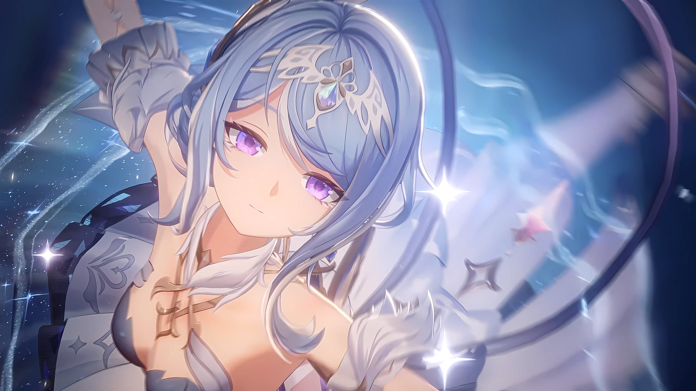
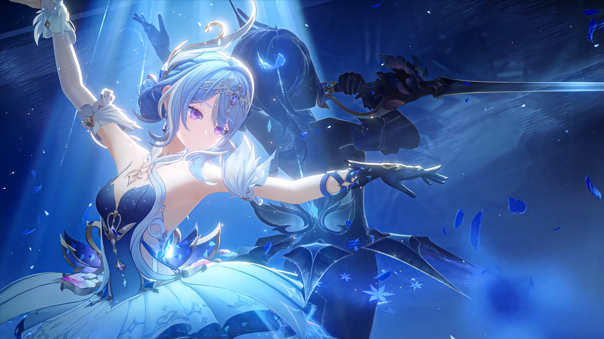

# dsh-odette-skin

[](https://beancookie.github.io/awesome-dsh-plugin)

Odette 冰雪梦幻主题 —— DSH 客户端的深/浅双模式 UI 美化皮肤。

> 仓库：https://github.com/lkdx0220/Genshin-odette-skin-dsh
> 主题：Genshin / Odette 同人

深/浅双模式背景图（米哈游官方素材）+ 13 个官方主题 token 毛玻璃覆盖 + 输入框装饰系统
（三层冰蓝边框 / 天鹅顶饰 / 套娃·应援棒组合 / 羽毛饰），内置明暗切换与皮肤开关
（左下角浮动层），离线本地资源，重启保留。

## 功能

- **深/浅双模式**：自动跟随客户端主题切换（深色=蓝白梦幻双人图，浅色=奥黛塔舞台场景官方截图）
- **主题 token 覆盖**：背景、层级、边框、品牌色、文字、状态色的蓝紫冰雪调
- **毛玻璃质感**：半透明面板 + body 背景图透出（`body::before` 伪元素层 + CSS filter 增强浅色对比度）
- **皮肤开关**：左下角浮层小兽（窄栏）或侧栏 footer ❄ 按钮（宽栏），点击即开关；皮肤关闭时入口以灰度+呼吸动画常驻，不会锁死
- **滚动条/选区美化**：蓝紫半透明滚动条 + 柔和文字选中色

## 安装

### 快速开始（npm registry，推荐）

```bash
# <name> 替换为你的 profile 名（如 web / demo）；未安装 dsh CLI 时用 npx @deepseek-ai/dsh 前缀
dsh plugin --profile <name> add dsh-odette-skin
# 例：npx @deepseek-ai/dsh plugin --profile web add dsh-odette-skin
```

已发布到 npm，包含预构建产物（`lib/` + `assets/` + `cordis.patch.yml`），无需构建授权。

### 方式一：注入器（本地开发，dsh-super-injector 环境）

```bash
dev_install_package C:\path\to\odette-skin      # 热装配到当前 profile
# 或运行时注入（不写 profile 配置）
dev_inject_plugin C:\path\to\odette-skin
```

### 方式二：手动装配（bundle 插件）

1. 构建产物（见下）
2. 在目标 profile 的 `package.json` 添加依赖与 `bundles` 条目：

```jsonc
// <profile>/package.json
{
  "dependencies": { "dsh-odette-skin": "link:<本目录绝对路径>" },
  "bundles": ["dsh-odette-skin"]
}
```

3. profile 的 `cordis.patch.yml` 追加：

```yaml
- insert:
    - id: odette-skin
      name: 'dsh-odette-skin'
```

4. `node_modules` 建 junction 链接后重启客户端。

### 方式三：tarball 安装（推荐分发，无需构建授权）

```bash
dsh plugin --profile <name> add ./dsh-odette-skin-0.0.1.tgz
```

构建产物已打包（`lib/` + `assets/` + `cordis.patch.yml`），安装即用。
（也可以直接从 GitHub Release 下载附件：`https://github.com/lkdx0220/Genshin-odette-skin-dsh/releases`）

### 方式四：从 GitHub 直接安装（源码 + prepare 自动构建）

```bash
dsh plugin --profile <name> add github:lkdx0220/Genshin-odette-skin-dsh
```

git 安装拉取的是源码，安装时由 `prepare` 脚本自动构建（自包含，无需 DSH_CHECKOUT）。
⚠️ pnpm ≥10 首次安装会被安全策略拦截——将以下内容加入该 profile 的 `pnpm-workspace.yaml` 授权构建：

```yaml
allowBuilds:
  'dsh-odette-skin': true
```

然后重新执行 `add`。若不想授权构建，改用方式三的 tarball 安装（无需任何构建授权）。

## 构建

自包含构建（无需 DSH_CHECKOUT / bash，跨平台）：

```bash
npm install
npm run build   # host: 本地 tsc → lib/index.js；client: tsdown → lib/client.js
```

`prepare` 脚本已声明，从 GitHub/npm 安装时会自动构建。

产物：`lib/`（host + client）+ `assets/`（背景图/小兽图）。

## 使用

- 皮肤开关：点击左下角小兽或侧栏 footer 的 ❄ 按钮
- 状态持久化于 `localStorage['dsh-odette-skin:enabled']`
- 窄栏（rail）状态：小兽自动居中上移，❄ 按钮隐藏，仅留小兽入口

## 目录结构

```
src/index.ts          # host：/odette-skin 静态资源路由（防路径穿越 + MIME + 缓存头）
src/client/index.ts   # client：token 覆盖 / 背景图 / 开关与浮层组件 / CSS
assets/               # 背景图与点缀图（本地资源，无需网络）
cordis.patch.yml      # bundle 层插件行
```

## 图片来源与授权

本项目所有背景与装饰素材均为《原神》官方内容（游戏内截图、角色 PV 截图、官方素材图），
版权归米哈游（HoYoverse）所有；仅用于本项目非商业展示，详见下方免责声明。

| 用途 | 来源 | 图 |
|---|---|---|
| 浅色背景 | 《原神》奥黛塔舞台场景截图（米哈游官方素材） |  |
| 深色背景 | 游戏内截图「奥黛塔聚所」（米哈游官方素材） |  |
| 深色 hero（新会话页背景） | 游戏内截图「奥黛塔聚所」（米哈游官方素材） | `assets/hero-dark.jpg` |
| 浅色 hero（新会话页背景） | 《原神》奥黛塔角色 PV「柔雪的幻象」截图（米哈游官方素材） | `assets/hero-light.jpg` |
| 输入框装饰（天鹅顶饰 / 应援棒 / 套娃 / 羽毛 / 海报等） | 《原神》官方素材图（米哈游官方素材） | `assets/odette-trio.webp` 等 |
| 标题 logo（明暗双版） | 作者基于 DeepSeek 品牌元素重绘（非米哈游素材，与 DeepSeek 无关联） | `assets/logo3.webp` / `assets/logo-dark.webp` |
| 顶部饰带 | 作者提供的 AI 生成素材（非米哈游素材，仅本项目使用） | `assets/banner-top.png` |

> 图片列使用仓库内相对路径（`./assets/…`），GitHub 渲染 README 时直接显示仓库文件，
> 不依赖 raw CDN（raw.githubusercontent.com 在部分网络环境不可达，且锁定旧 SHA 会显示旧图）。

## 免责声明 / Disclaimer

本项目为粉丝同人作品，与米哈游、HoYoverse、DeepSeek 无任何关联，也未获得官方授权。
文中所有《原神》相关素材（游戏内截图、PV 截图、官方素材图等）版权归米哈游（HoYoverse）所有，
仅用于技术学习与个人非商业使用。如权利人认为不妥，请联系我删除。

This project is a fan-made work. It is not affiliated with or endorsed by miHoYo, HoYoverse,
or DeepSeek, and has not received any official authorization. All Genshin Impact related
assets used here (in-game screenshots, PV screenshots, official artwork, etc.) are the
property of miHoYo / HoYoverse and are used for technical study and personal non-commercial
use only. If you believe any content should not be used here, please contact me and it will
be removed.

## 致谢 / Acknowledgements

本皮肤的输入框相位动画节奏、input-mirror 高度同步、侧栏宽度投影与状态投影架构改编自
[maid-atelier（dsh-deep-whale）](https://github.com/Small-tailqwq/dsh-deep-whale)，作者 Small-tailqwq，
遵循其 CC BY-NC-SA 4.0 许可。未复制其任何美术素材。完整署名链见 [NOTICE](./NOTICE)。

The composer motion timing, input-mirror height sync, sidebar-width projection and
status-projection architecture are adapted from
[maid-atelier (dsh-deep-whale)](https://github.com/Small-tailqwq/dsh-deep-whale) by Small-tailqwq,
under its CC BY-NC-SA 4.0 license. No artwork from maid-atelier is copied.
See [NOTICE](./NOTICE) for the full attribution chain.

## 设计反馈 / Design Feedback

本人不擅长美术设计，如果你对本皮肤的设计有哪里觉得可以改得更好——尤其是这个输入框，
我是真没招了——可以直接给我提出修改意见；要是能顺手甩我一份设计稿欣赏，那就更好了
（尤其是输入框美化，期待被惊艳一下，嘻嘻）。

Honestly, I'm no artist, so if you see anything in this skin that could be improved —
especially the input box, which I've genuinely run out of ideas for — feel free to
share your suggestions directly. Even better, a quick design mockup to admire would
make my day (the composer styling above all, hehe 😄).

## License

CC BY-NC-SA 4.0（代码与样式，含完整的署名链 NOTICE）；配图版权归米哈游（HoYoverse）所有
（官方素材，见「图片来源与授权」与免责声明）。
